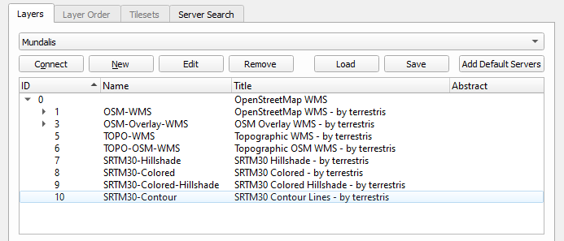

 

WMS 是  [*web map service*](https://en.wikipedia.org/wiki/Web_Map_Service) 的缩写，是一种流行的通过专业 GIS 软件发布地图的方式（非 GIS 人员很少使用）。这种格式类似于地图瓦片，它虽然没有针对在 web 地图中的使用进行很好的优化，但更通用。WMS 图像由其角的坐标定义 - 通过 Leaflet 引起进行计算。

TMS 代表 [*tiled map service*](https://en.wikipedia.org/wiki/Tile_Map_Service)，是一种地图平铺标准，更侧重于网络地图，非常类似于 Leaflet 在 `L.TileLayer`。

WMTS 是 [*web map tile service*](https://en.wikipedia.org/wiki/Web_Map_Tile_Service) 的意思，是地图瓦片的标准协议，为可直接用于 `L.TileLayer` 的地图瓦片服务。

## Leaflet 中的 WMS

当有人发布一个 WMS 服务时，很可能他们会链接到一个叫做 "GetCapabilities" 的地址。在本教程中，我们将使用由 [*Mundialis*](https://www.mundialis.de) 提供的 WMS，网址为 http://ows.mundialis.de/services/service。下面的 URL 描述了服务功能：

	http://ows.mundialis.de/services/service?request=GetCapabilities

Leaflet 并不理解 WMS 的 `GetCapabilities` 文档。相反，因此你必须创建一个 `L.TileLayer.WMS` 图层，提供基本的 WMS URL，并指定你需要的任何 WMS 选项。

基本 WMS URL 只是 `GetCapabilities` ，没有任何参数，如下所示：

	http://ows.mundialis.de/services/service?

在 Leaflet 地图中使用它的方法很简单：

	var map = L.map(mapDiv, mapOptions);

	var wmsLayer = L.tileLayer.wms('http://ows.mundialis.de/services/service?', wmsOptions).addTo(map);

一个实例 `L.TileLayer.WMS` 至少需要一个选项：`layers`. 请注意，Leaflet 中 `layer` 的概念与 WMS 中 `layer` 的概念不同！

WMS 服务器在服务中定义了一系列的图层（layers）,这些是在 `GetCapabilitiesXML` 文档中定义的，大多数时候它是乏味且难以理解的，通常使用 [QGIS](http://www.qgistutorials.com/en/docs/working_with_wms.html) 查看 WMS 服务器中可用的图层以及名称是个不错的选择：

我们可以看到 *Mundialis* WMS 有一个以 `TOPO-OSM-WMS`  底图命名的 WMS 图层。让我们看看它的样子：

	var wmsLayer = L.tileLayer.wms('http://ows.mundialis.de/services/service?', {
		layers: 'TOPO-OSM-WMS'
	}).addTo(map);



或者我们可以试试 `SRTM30-Colored-Hillshade` 的 WMS 图层：

	var wmsLayer = L.tileLayer.wms('http://ows.mundialis.de/services/service?', {
		layers: 'SRTM30-Colored-Hillshade'
	}).addTo(map);



该 `layers` 选项是以逗号分隔的图层列表。如果 WMS 服务定义了多个图层，则对地图图像的请求可以引用多个图层。

对于我们使用的示例 WMS 服务器，有一个 `TOPO-WMS` 显示世界地形的 `OSM-Overlay-WMS` 图层和一个显示地名的 WMS 图层。如果我们请求两个图层，WMS 服务器会将两个图层组合在一个图像中，用逗号分隔：

	var topographyAndPlaces = L.tileLayer.wms('http://ows.mundialis.de/services/service?', {
		layers: 'TOPO-WMS,OSM-Overlay-WMS'
	}).addTo(map);

请注意，这将向 WMS 服务器请求一张图像。这不同于 L.TileLayer.WMS 为 **topography** 创建一个图层，为 **places** 创建另一个图层，然后将它们都添加到地图中。在第一种情况下，有一个图像请求，由 WMS 服务器决定如何合成（置于彼此之上）图像。在第二种情况下，将有两个图像请求，由运行在 Web 浏览器中的 Leaflet 代码决定如何组合它们。

如果我们将其与 [layers control 图层控件](/examples/layers-control.html)结合起来，那么我们可以构建一个简单的地图来查看差异：

	var basemaps = {
		Topography: L.tileLayer.wms('http://ows.mundialis.de/services/service?', {
			layers: 'TOPO-WMS'
		}),

		Places: L.tileLayer.wms('http://ows.mundialis.de/services/service?', {
			layers: 'OSM-Overlay-WMS'
		}),

		'Topography, then places': L.tileLayer.wms('http://ows.mundialis.de/services/service?', {
			layers: 'TOPO-WMS,OSM-Overlay-WMS'
		}),

		'Places, then topography': L.tileLayer.wms('http://ows.mundialis.de/services/service?', {
			layers: 'OSM-Overlay-WMS,TOPO-WMS'
		})
	};

	L.control.layers(basemaps).addTo(map);

	basemaps.Topography.addTo(map);

更改为 **Topography**，然后切换为 **places** 选项，这样您就可以看到地形**顶部**的位置，但 WMS 服务器足够聪明，可以在其上显示建筑标签。当需要多个图层时，由 WMS 服务器决定如何组合图层。



### WMS 服务的 GIS 用户注意事项

从 GIS 的角度来看，Leaflet 中的 WMS 处理是非常基础的。没有 `GetCapabilities`  支持，没有  legend 支持，也没有 `GetFeatureInfo` 支持。

`L.TileLayer.WMS` 有额外的选项，可以在 [Leaflet 的 API 文档]（/reference.html#tilelayer-wms）中找到。任何没有描述的选项都会在 `getImage` URLs中传递给 WMS 服务器。

还要注意 Leaflet 支持很少的[坐标系](https://en.wikipedia.org/wiki/Spatial_reference_system)：`CRS:3857`，`CRS:3395` 和 `CRS:4326`（见 `L.CRS` 的文档）。如果您的 WMS 服务不提供这些坐标系中的图像，则您可能需要使用 [Proj4Leaflet](https://github.com/kartena/Proj4Leaflet) 在 Leaflet 中使用不同的坐标系。除此之外，只需在初始化地图时使用正确的 CRS，添加的任何 WMS 图层都将使用它：

	var map = L.map('map', {
		crs: L.CRS.EPSG4326
	});

	var wmsLayer = L.tileLayer.wms('http://ows.mundialis.de/services/service?', {
		layers: 'TOPO-OSM-WMS'
	}).addTo(map);


	
	
## Leaflet 中的 TMS

Leaflet 没有明确支持 TMS 服务，但是瓦片（Tile）的命名结构与常见的 `L.TileLayer` 命名方案非常相似，所以显示TMS服务几乎是很简单的事情。

让我们尝试一下具有以下端点的 TMS 服务：

	http://base_url/tms/1.0.0

查看 [TMS 关于 MapCache 的帮助文档](http://mapserver.org/mapcache/services.html) 以及 [TMS 规范](https://wiki.osgeo.org/wiki/Tile_Map_Service_Specification)，您可以看到 TMS 中地图图块的 URL 如下所示：

	http://base_url/tms/1.0.0/ {tileset} / {z} / {x} / {y} .png

如果要将 TMS 服务用作 `L.TileLayer`，我们可以检查功能文档（与 base endpoint 相同，在我们的例子中是[`http://base_url/tms/1.0.0`](http://base_url/tms/1.0.0)），以查看有哪些 `tileset` 可用，并建立我们并构建我们的基本 URL：

	http://base_url/tms/1.0.0/{example_layer}@png/{z}/{x}/{y}.png

并在实例化图层时使用 `tms:true` 选项，像这样：

	var tms_example = L.tileLayer('http://base_url/tms/1.0.0/example_layer@png/{z}/{x}/{y}.png', {
		tms: true
	}).addTo(map);

在 **Leaflet 1.0** 中的一个新功能是能够在 URL 中使用 `{-y}` 而不是 `tms: true` 选项，例如：

	var layer = L.tileLayer('http://base_url/tms/1.0.0/tileset/{z}/{x}/{-y}.png');

我们需要 `tms: true`  选项（在 Leaflet 0.7 中）或 `{-y}`（在 Leaflet 1.0 中），因为 `L.TileLayer` 的坐标原点是左上角，所以 Y 坐标**向下**。在TMS中 坐标的原点是左下角，所以 Y 坐标是**向上**的。

除了 `y` 坐标和 `tilesets` 发现的差异之外，TMS 服务完全按照 `L.TileLayer` 预期的方式提供瓦片。
